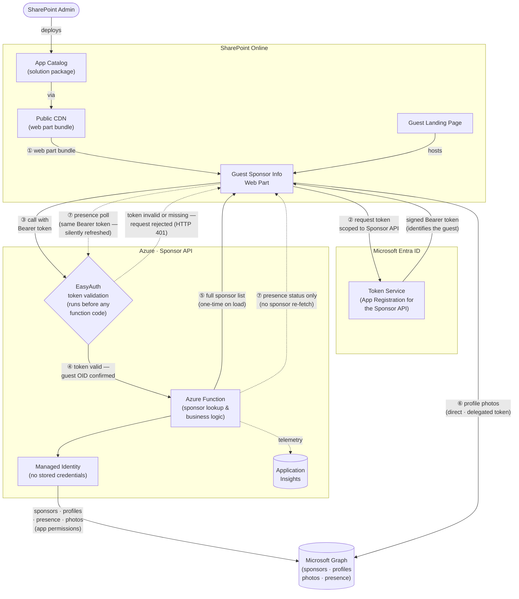
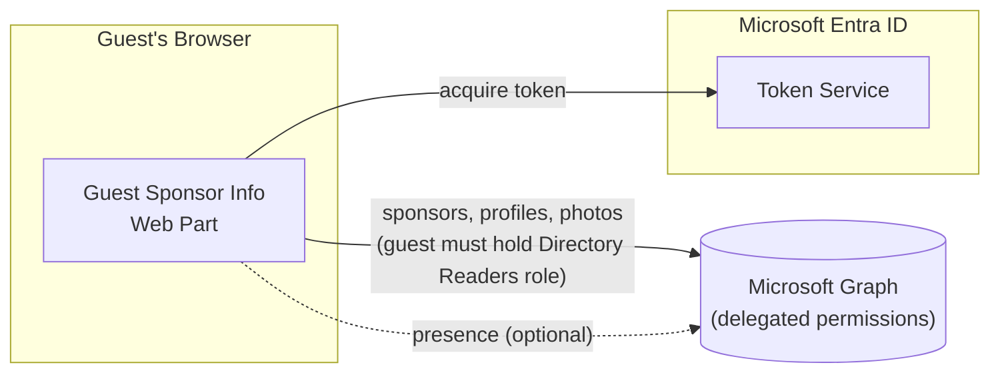

# Architecture Diagram

Visual system-level overview of the *Guest Sponsor Info* solution.
For the written design decisions behind each component, see [architecture.md](architecture.md).

---

## System Overview — Recommended Path (Azure Function Proxy)

The diagram covers two aspects: **how the web part reaches the guest's browser**
(delivery, grey arrows) and **how it retrieves and keeps data current at runtime**
(numbered arrows). Steps ②–③ make the authentication handshake explicit — the web
part cannot call the Sponsor API without first obtaining a signed token from Entra ID.
Presence status (step ⑦) is kept up-to-date through a separate polling loop that reuses
the same token and the same EasyAuth gate, but only fetches presence — not the full
sponsor list.

### What each step means

| Step | What happens |
|---|---|
| ① | The guest opens the SharePoint landing page. The browser loads the web part bundle from the Public CDN — no App Catalog access needed at runtime. |
| ② | The web part silently requests a token from Entra ID, scoped specifically to the Sponsor API's App Registration. No extra guest consent is required — the scope is pre-authorized for SharePoint. |
| ③ | Only after a valid token is in hand does the web part call the Sponsor API, with the Bearer token attached. There is no direct path to the function without this token. |
| ④ | EasyAuth intercepts the request at the Azure Function boundary and validates the token before any function code runs. An invalid or missing token is rejected immediately (HTTP 401); the function never sees the request. |
| ⑤ | The function identifies the guest from the EasyAuth-confirmed OID and calls Microsoft Graph using its own Managed Identity. It returns the full sponsor list — sponsors, profiles, and manager — in one response. This happens **once on page load**. |
| ⑥ | Profile photos are loaded **directly** from Graph using the guest's own delegated token. They bypass the function entirely. |
| ⑦ | After the initial load, the web part polls the Sponsor API for **presence status only** at adaptive intervals — **30 seconds** while a sponsor card is hovered, **2 minutes** while the browser tab is visible, **5 minutes** while the tab is in the background. The token is silently refreshed by the browser before it expires; the EasyAuth gate applies on every poll just as on the initial call. The full sponsor list is never re-fetched during polling. |

---

## Fallback Path — Direct Graph (legacy, no Azure Function)

When no Azure Function URL is configured, the web part calls Microsoft Graph
directly with the guest's delegated token. This requires the guest account to
hold an Entra directory role (*Directory Readers*) — impractical at scale.
The Azure Function proxy removes that requirement.

---

## Component Summary

| Component | Role |
|---|---|
| SharePoint App Catalog | Stores the packaged solution; publishes assets to the CDN |
| Public CDN | Delivers the web part JavaScript bundle to the guest's browser |
| Web Part | Guest-facing UI rendered inside the SharePoint page |
| Token Service (Entra ID) | Issues tokens that identify the guest — no directory role needed |
| Sponsor API (Azure Function) | Secure proxy between the web part and Graph; enforces caller identity |
| EasyAuth | Validates tokens at the function boundary before any code runs |
| Managed Identity | Allows the function to call Graph without any stored credentials |
| Microsoft Graph | Source of sponsor relationships, profiles, photos, and presence |
| Application Insights | Telemetry and structured error logs for the function |

---

## Related Documents

- [architecture.md](architecture.md) — design decisions, known limitations, SPFx lifecycle
- [deployment.md](deployment.md) — step-by-step deployment, Azure Function setup, hosting plans
- [development.md](development.md) — local dev setup, build & test commands
- [features.md](features.md) — feature descriptions and the problems they solve
- [README](../README.md) — quick-start and overview
- [Azure Function README](../azure-function/README.md) — function-specific permissions and security design
