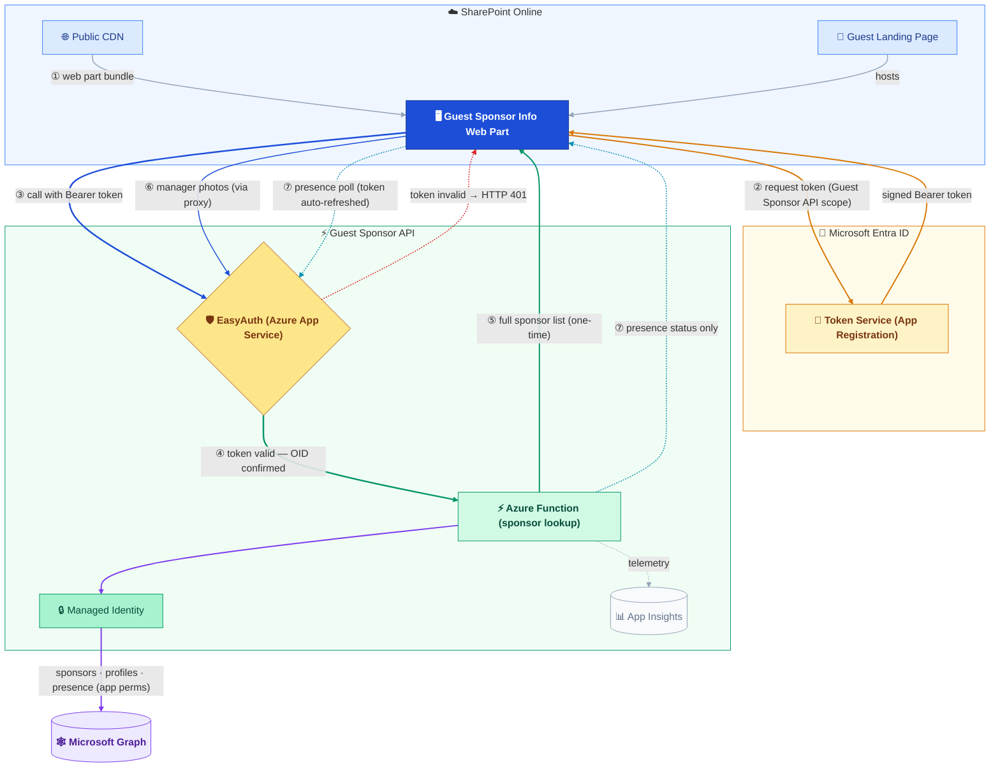

# Architecture Diagram

Visual system-level overview of the *Guest Sponsor Info* solution.
For the written design decisions behind each component, see [architecture.md](architecture.md).

The recommended path (Guest Sponsor API) is split into two diagrams:
**Setup** shows who configures what during deployment; **Runtime** shows what
happens each time a guest opens the landing page.

---

## Setup — Admin Roles and Automation (Recommended Path)

The setup path always combines SharePoint administration with Azure and Entra
responsibilities. The **SharePoint Admin** only needs the standard SharePoint
Administrator role. The Azure-side rollout is started by a **Deployment
Operator**; the Graph-permission step is an **Entra Admin** responsibility.
In the default one-step path, the same person can wear both hats at once. In
split-duty or PAW deployments, Step 4 remains a separate Entra-admin action.

```mermaid
flowchart LR
    classDef admin    fill:#f1f5f9,stroke:#64748b,color:#1e293b,font-weight:bold
    classDef delivery fill:#dbeafe,stroke:#3b82f6,color:#1e3a8a
    classDef token    fill:#fef3c7,stroke:#d97706,color:#78350f,font-weight:bold
    classDef gate     fill:#fde68a,stroke:#b45309,color:#78350f,font-weight:bold
    classDef func     fill:#d1fae5,stroke:#059669,color:#064e3b,font-weight:bold
    classDef infra    fill:#a7f3d0,stroke:#059669,color:#064e3b
    classDef logs     fill:#f8fafc,stroke:#94a3b8,color:#64748b
    classDef msgraph  fill:#ede9fe,stroke:#7c3aed,color:#4c1d95,font-weight:bold
    classDef tool     fill:#e0f2fe,stroke:#0284c7,color:#0c4a6e,font-weight:bold

    SpAdmin(["🧑‍💼 SharePoint Admin"]):::admin
    DeployOp(["🧑‍💼 Deployment Operator"]):::admin
    EntraAdmin(["🧑‍💼 Entra Admin"]):::admin
    Deploy["🧰 Deployment automation<br/>install.ps1 / deploy-azure.ps1 / azd"]:::tool

    subgraph spo["☁️ SharePoint Online"]
        SCAC["📦 Site Collection App Catalog (landing page site)"]:::delivery
        Visitors["👥 Visitors (landing page site)"]:::delivery
    end

    subgraph entra["🔐 Microsoft Entra ID"]
        AppReg["🔑 App Registration (EasyAuth)"]:::token
        SP["🪪 Service Principal (Enterprise App)"]:::token
    end

    subgraph azure["⚡ Guest Sponsor API"]
        Func["⚡ Azure Function"]:::func
        MI["🔒 Managed Identity"]:::infra
        AI[("📊 App Insights")]:::logs
    end

    Graph[("🕸️ Microsoft Graph")]:::msgraph

    SpAdmin -- "① uploads .sppkg"              --> SCAC
    SpAdmin -- "② grants access (Everyone)"    --> Visitors

    DeployOp -- "③ runs deployment flow"       --> Deploy
    Deploy  -- "creates EasyAuth app"          --> AppReg
    AppReg  -. "auto-creates"                .-> SP
    Deploy  -- "provisions Function App"       --> Func
    Func    -. "EasyAuth bound to"            .-> SP
    EntraAdmin -- "④ completes Graph-permission step" --> MI
    Func    -. "uses"                        .-> MI
    MI      -- "Graph app permissions"        --> Graph
    Deploy  -. "provisions"                  .-> AI

    style spo   fill:#eff6ff,stroke:#3b82f6
    style entra fill:#fffbeb,stroke:#d97706
    style azure fill:#f0fdf4,stroke:#059669

    %% 0     SharePoint delivery (step ①)
    linkStyle 0     stroke:#94a3b8,stroke-width:1.5px
    %% 1     guest Visitor access (step ②)
    linkStyle 1     stroke:#94a3b8,stroke-width:1.5px
    %% 2     deployment flow started (step ③)
    linkStyle 2     stroke:#0284c7,stroke-width:2px
    %% 3     App Registration created by automation
    linkStyle 3     stroke:#d97706,stroke-width:2px
    %% 4     AppReg auto-creates SP
    linkStyle 4     stroke:#d97706,stroke-width:1px
    %% 5     Function App provisioned by automation
    linkStyle 5     stroke:#059669,stroke-width:2px
    %% 6     EasyAuth bound to SP
    linkStyle 6     stroke:#d97706,stroke-width:1.5px
    %% 7     permission grant step (④)
    linkStyle 7     stroke:#059669,stroke-width:2px
    %% 8     Func uses MI
    linkStyle 8     stroke:#a7f3d0,stroke-width:1.5px
    %% 9     MI→Graph permission
    linkStyle 9     stroke:#7c3aed,stroke-width:2px
    %% 10    App Insights provisioned
    linkStyle 10    stroke:#94a3b8,stroke-width:1px
```

### Required permissions

| Step | Who | What happens | Required role / permission |
|---|---|---|---|
| 1 | SharePoint Admin | Enables Site Collection App Catalog on the landing page site and uploads `.sppkg` | **SharePoint Administrator** (+ **Site Collection Admin** on the landing page site) |
| 2 | SharePoint Admin | Verifies guest Visitor access on the landing page site. If you rely on the *Everyone* group pattern for B2B guests, explicitly enable `ShowEveryoneClaim` first; otherwise keep the site's existing reliable guest-access model. | **SharePoint Administrator** |
| 3 | Deployment Operator | Runs `install.ps1` / `deploy-azure.ps1`. The deployment automation then provisions Azure resources, Storage role assignments, the EasyAuth App Registration (via Microsoft Graph Bicep extension), and the Function App. | Azure **Contributor** + **Owner** (or **User Access Administrator**) on the target resource group + Entra **Cloud Application Administrator** |
| 4 | Entra Admin | Completes the Graph permission assignment step. In the default one-step path this happens inside the deployment flow; in PAW / split-duty setups it is run separately via `setup-graph-permissions.ps1`. | **Privileged Role Administrator** |

In smaller deployments, the same person can perform Steps 3 and 4 by
activating both the Azure and Entra roles temporarily. In PAW or split-duty
setups, treat Step 4 as a separate Entra-admin action.

¹ `Contributor` alone is not sufficient — the template creates
`Microsoft.Authorization/roleAssignments` on the Storage Account.
Cloud Application Administrator is required for the Microsoft Graph Bicep
extension to create and configure the App Registration.

² Granting application permissions (app roles) to a Managed Identity requires
`AppRoleAssignment.ReadWrite.All`, which requires Privileged Role Administrator
or higher. This is an Entra directory action, not just an Azure resource
deployment permission.

---

## Runtime — Guest Experience (Recommended Path)

Color-coding marks system boundaries at a glance:
**blue** = SharePoint Online · **amber** = Microsoft Entra ID ·
**green** = Guest Sponsor API · **purple** = Microsoft Graph.
Steps ②–③ show the authentication handshake — the web part cannot call the
Guest Sponsor API without first obtaining a signed token from Entra ID.
Step ⑦ is a separate polling loop that only fetches presence, never the full
sponsor list.

### What each step means

| Step | What happens |
|---|---|
| ① | The guest opens the SharePoint landing page. The browser loads the web part bundle from the Public CDN — no App Catalog access needed at runtime. |
| ② | The web part silently requests a token from Entra ID, scoped specifically to the Guest Sponsor API's App Registration. No extra guest consent is required — the scope is pre-authorized for SharePoint. |
| ③ | Only after a valid token is in hand does the web part call the Guest Sponsor API, with the Bearer token attached. There is no direct path to the function without this token. |
| ④ | [EasyAuth](https://learn.microsoft.com/azure/app-service/overview-authentication-authorization) (Microsoft Azure App Service Authentication) intercepts the request at the Azure Function boundary and validates the token before any function code runs. An invalid or missing token is rejected immediately (HTTP 401); the function never sees the request. |
| ⑤ | The function identifies the guest from the EasyAuth-confirmed OID and calls Microsoft Graph using its own Managed Identity. It returns the full sponsor list — sponsors, profiles, and manager — in one response. This happens **once on page load**. |
| ⑥ | Manager photos are fetched via the Azure Function's `/api/getPhoto` proxy endpoint. Sponsor photos are already embedded in the ⑤ response and need no separate request. |
| ⑦ | After the initial load, the web part polls the Guest Sponsor API for **presence status only** at adaptive intervals — **30 seconds** while a sponsor card is hovered, **2 minutes** while the browser tab is visible, **5 minutes** while the tab is in the background. The token is silently refreshed by the browser before it expires; the EasyAuth gate applies on every poll just as on the initial call. The full sponsor list is never re-fetched during polling. |

---

## Component Summary

| Component | Role |
|---|---|
| SharePoint App Catalog | Stores the packaged solution; publishes assets to the CDN |
| Public CDN | Delivers the web part JavaScript bundle to the guest's browser |
| Web Part | Guest-facing UI rendered inside the SharePoint page |
| Token Service (Entra ID) | Issues tokens that identify the guest — no directory role needed |
| Guest Sponsor API | Secure proxy between the web part and Microsoft Graph; validates caller identity via EasyAuth and calls Graph using a Managed Identity |
| [EasyAuth](https://learn.microsoft.com/azure/app-service/overview-authentication-authorization) | Microsoft Azure App Service Authentication — validates tokens at the function boundary before any code runs |
| Managed Identity | Allows the function to call Graph without any stored credentials |
| Microsoft Graph | Source of sponsor relationships, profiles, photos, and presence |
| Application Insights | Telemetry and structured error logs for the function |

---

## Related Documents

- [architecture.md](architecture.md) — design decisions, known limitations, SPFx lifecycle
- [deployment.md](deployment.md) — step-by-step deployment, Guest Sponsor API setup, hosting plans
- [development.md](development.md) — local dev setup, build & test commands
- [features.md](features.md) — feature descriptions and the problems they solve
- [README](../README.md) — quick-start and overview
- [Azure Function README](../azure-function/README.md) — function-specific permissions and security design
