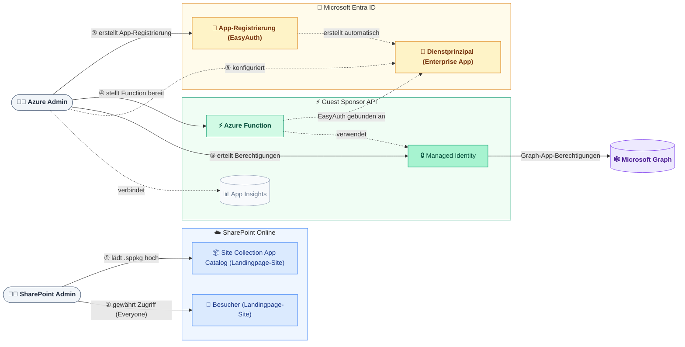
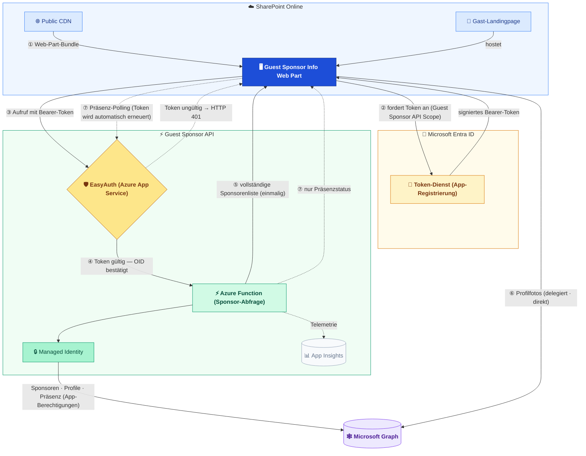

## Setup — Zwei Admin-Rollen

Zwei separate Admin-Personas sind an der Einrichtung beteiligt.
Der **SharePoint-Admin** benötigt nur die Standard-SharePoint-Administrator-Rolle.
Der **Azure-Admin** übernimmt drei verschiedene Aufgaben — Azure-Ressourcen-
Bereitstellung, Entra-ID-App-Konfiguration und Graph-Berechtigungsvergabe —
die jeweils unterschiedliche erweiterte Berechtigungen erfordern.

### Erforderliche Berechtigungen

| Schritt | Wer | Was passiert | Erforderliche Rolle |
|---|---|---|---|
| ① | SharePoint-Admin | Aktiviert Site Collection App Catalog und lädt `.sppkg` hoch | **SharePoint-Administrator** + Websitesammlungsadministrator |
| ② | SharePoint-Admin | Prüft oder richtet Gast-Besucherzugriff ein | **SharePoint-Administrator** |
| ③ | Azure-Admin | Erstellt die App-Registrierung (`setup-app-registration.ps1`) | **Anwendungsadministrator** |
| ④ | Azure-Admin | Stellt ARM-Vorlage bereit — Azure-Ressourcen + Speicher-Rollenzuweisungen | **Besitzer** der Ziel-Ressourcengruppe |
| ⑤ | Azure-Admin | Erteilt Graph-Berechtigungen an Managed Identity (`setup-graph-permissions.ps1`) | **Administrator für privilegierte Rollen** |

---

## Laufzeit — Gast-Erlebnis

Farbcodierung kennzeichnet Systemgrenzen:
**Blau** = SharePoint Online · **Bernstein** = Microsoft Entra ID ·
**Grün** = Guest Sponsor API · **Violett** = Microsoft Graph.

### Was jeder Schritt bedeutet

| Schritt | Was passiert |
|---|---|
| ① | Der Gast öffnet die SharePoint-Landingpage. Der Browser lädt das Web-Part-Bundle vom Public CDN. |
| ② | Das Web Part fordert lautlos ein Token von Entra ID an, das auf die Guest Sponsor API beschränkt ist. Keine zusätzliche Einwilligung erforderlich. |
| ③ | Das Web Part ruft die Guest Sponsor API mit dem angehängten Bearer-Token auf. |
| ④ | [EasyAuth](https://learn.microsoft.com/azure/app-service/overview-authentication-authorization) validiert das Token, bevor Function-Code ausgeführt wird. Ungültige Tokens werden sofort abgelehnt (HTTP 401). |
| ⑤ | Die Function identifiziert den Gast anhand der EasyAuth-bestätigten OID und ruft Microsoft Graph mit ihrer Managed Identity auf. Gibt die vollständige Sponsorenliste in einer Antwort zurück. |
| ⑥ | Profilfotos werden **direkt** aus Graph mit dem eigenen delegierten Token des Gastes geladen — sie umgehen die Function vollständig. |
| ⑦ | Nach dem initialen Laden wird Präsenz in adaptiven Intervallen abgefragt: **30 s** (Karte überfahren) · **2 Min.** (Tab sichtbar) · **5 Min.** (Tab verborgen). |

---

## Komponentenübersicht

| Komponente | Aufgabe |
|---|---|
| SharePoint App Catalog | Speichert die paketierte Lösung; veröffentlicht Assets im CDN |
| Public CDN | Liefert das Web-Part-JavaScript-Bundle an den Browser des Gastes |
| Web Part | Gastbezogene Benutzeroberfläche in der SharePoint-Seite |
| Token-Dienst (Entra ID) | Stellt Tokens aus, die den Gast identifizieren |
| Guest Sponsor API | Sicherer Proxy; validiert Identität via EasyAuth, ruft Graph mit Managed Identity auf |
| EasyAuth | Azure App Service Authentication — validiert Tokens an der Function-Grenze |
| Managed Identity | Ermöglicht der Function Graph-Aufrufe ohne gespeicherte Anmeldeinformationen |
| Microsoft Graph | Quelle für Sponsor-Beziehungen, Profile, Fotos und Präsenz |
| Application Insights | Telemetrie und strukturierte Fehlerprotokolle der Function |
