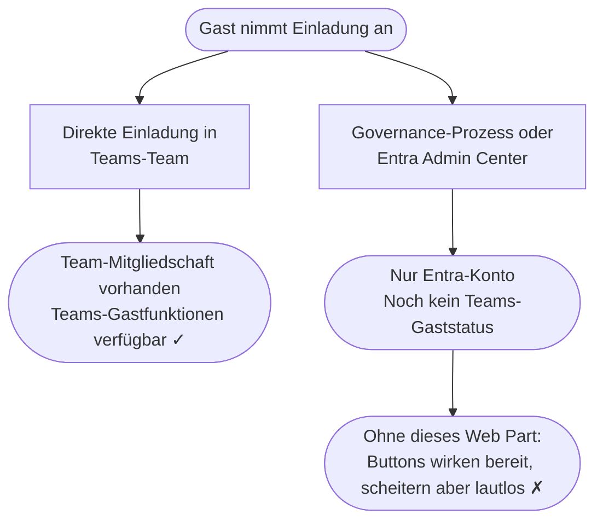

## Die Lücke, über die niemand spricht {#die-luecke}

Ein Gast klickt auf „Annehmen" bei Ihrer Microsoft-365-Einladung. Ein Entra-Konto
wird angelegt. Technisch gesehen ist diese Person jetzt in Ihrem Mandanten.

Was *nicht* garantiert ist: dass der Gast irgendjemanden erreichen kann.

Die Sponsor-Beziehung kann in Entra bereits hinterlegt sein. Für den Gast
bleibt sie trotzdem unsichtbar. Es gibt in SharePoint keine eingebaute
Oberfläche, die ihm zeigt, wer seine Sponsoren sind — geschweige denn, wie
er sie erreichen kann.

Ob Teams für diesen Gast funktioniert, hängt an einem zentralen Punkt: Wurde
dieser Gast in Ihrem Tenant bereits mindestens einem Teams-Team hinzugefügt oder
nicht?

Genau daraus entsteht eine kommunikative Lücke: Die Organisation weiß womöglich
bereits, wer für diesen Gast zuständig ist. Der Gast selbst kann davon aber
nichts sehen.

## Warum eine Entrance-Seite wichtig ist {#entrance-page}

In vielen Governance-getriebenen Einladungsprozessen wird aus der Weiterleitung
nach der Annahme keine bewusst gestaltete Gastreise. Wenn der Workflow den Gast
nicht an ein besseres Ziel schickt, landet er oft in MyApps — einem generischen
Ziel ohne Erklärung, wo er ist, wer für ihn zuständig ist oder was der nächste
Schritt sein soll.

Technisch ist ein tenant-spezifischer Teams-Deeplink kein Problem. Graph-API-
basierte Einladungen können ein anderes Redirect-Ziel setzen, und Governance-
Tools können das häufig ebenfalls. Aber ein Teams-Link hilft nur dann, wenn der
Gast Ihren Tenant in Teams auch wirklich betreten kann. Existiert noch keine
Team-Mitgliedschaft, kann der Gast die Einladung erfolgreich annehmen und
trotzdem nicht in den Resource Tenant in Teams wechseln — manchmal ihn dort
nicht einmal sehen.

Genau deshalb ist eine SharePoint-Entrance-Seite so sinnvoll. Sie ist ein
stabiler, kontrollierbarer erster Zielort, der schon funktioniert, bevor das
Teams-Onboarding abgeschlossen ist. Die Schwäche ist nur: Mit Boardmitteln
kann SharePoint dort vor allem statische Hinweise und allgemeine Links zeigen.
Die tatsächlichen Sponsoren des Gastes kann SharePoint nicht einblenden.

## Zwei Einladungswege, zwei sehr verschiedene Ergebnisse {#zwei-wege}

### Direkte Einladung in ein Teams-Team

Eine interne Person fügt einen externen Kontakt direkt einem Team hinzu.
Microsoft sendet die Einladung im Hintergrund. Sobald der Gast annimmt und
diese erste Team-Mitgliedschaft existiert, stehen die Teams-Gastfunktionen in
Ihrem Tenant grundsätzlich zur Verfügung.

**Der Gast ist dann nicht nur in Entra, sondern hat auch einen echten Teams-Einstiegspunkt.**

### Über einen Governance-Prozess oder das Entra Admin Center

Eine Lifecycle-Governance-Plattform, ein Skript oder ein Entra-Admin-Workflow legt
das Gastkonto formal an. Das Konto existiert in Entra — aber noch kein Teams-Team
wurde zugewiesen.

**Der Gast existiert in Entra. Die Teams-Gastfunktionen fehlen aber noch.**

Dieser Zustand ist für den Gast unsichtbar — und bleibt ohne explizites Feedback
völlig verborgen.

## Was ein Gast sieht {#was-ein-gast-sieht}

Ohne Guest Sponsor Info auf der Seite beantwortet eine
SharePoint-Landingpage meist genau die Fragen nicht, die der Gast hat:

| Frage | Ohne dieses Web Part |
|---|---|
| Wer sind meine Sponsoren? | Für den Gast nicht sichtbar |
| Wer sind meine Ersatz-Sponsoren? | Für den Gast nicht sichtbar |
| Wie kann ich sie erreichen? | Für den Gast nicht sichtbar |
| Gibt es Manager-Kontext, der mir zur Orientierung hilft? | Für den Gast nicht sichtbar |
| Ist Teams für Kontakt schon bereit? | Für den Gast nicht sichtbar |
| Falls es eine eigene Kontaktaktion gibt | Sie kann bereit wirken und trotzdem lautlos scheitern |

> Es gibt keinen Fehler. Keine Erklärung. Der Gast hat keine Möglichkeit zu
> erkennen, ob der Button defekt ist, ob er etwas falsch gemacht hat, oder ob
> die Funktion für ihn schlicht noch nicht bereit ist.

Mit Guest Sponsor Info auf der Seite wird aus dieser abstrakten Beziehung eine
echte, sichtbare Kontaktfläche für den Gast:

## Was dieses Web Part macht {#was-das-web-part-macht}

**Guest Sponsor Info** liegt auf der SharePoint-Landingpage, auf der Gäste nach
der Einladungsannahme landen. Es macht drei Dinge:

1. **Zeigt Sponsoren** — die internen Mitarbeiter, die in Microsoft Entra als
  Verantwortliche für den Gastzugang eingetragen sind. Diese Beziehung ist in
  Entra bereits vorhanden, war für den Gast selbst aber bislang nicht sichtbar.
  Das Web Part macht daraus Namen, Gesichter, Titel und echte
  Kontaktmöglichkeiten direkt auf der Landingpage. Keine Konfiguration pro
  Gast. Keine manuelle Aktualisierung bei Sponsorwechsel.

2. **Zeigt Ersatz-Sponsoren und optionalen Manager-Kontext** — der Gast sieht
  nicht nur die Person, die ihn irgendwann eingeladen hat. Er sieht auch
  Ersatz-Sponsoren und ausgewählte Manager-Informationen, die die
  Kontaktstruktur verständlicher machen.

3. **Erkennt den Teams-Status** — wenn die Teams-Präsenz noch nicht aufgebaut
   wurde, erkennt das Web Part das und reagiert: Chat- und Anruf-Buttons werden
   deaktiviert, und eine klare Statusmeldung erklärt die Situation. Der Gast
   sieht ein Gesicht, einen Namen und eine ehrliche Statusanzeige — keinen
   defekten Button.

Ein Gast, dessen Teams-Zugang noch bereitgestellt wird, kann seinen Sponsor per
E-Mail erreichen und weiß, dass Teams in Kürze folgt. Und auch danach bleibt
das Web Part wertvoll: Selbst in Teams sieht der Gast nicht einfach, wer seine
Sponsoren sind. Er müsste die Namen bereits kennen und dort gezielt nach ihnen
suchen.

  

    
Bereit loszulegen?

    
Der integrierte Setup-Assistent führt Sie durch den Rest.

  

  

    <a href="{{ '/de/setup/' | relative_url }}" class="btn btn-teal">Installationsanleitung</a>
    <a href="{{ '/de/features/' | relative_url }}" class="btn btn-outline">Features entdecken</a>
  

