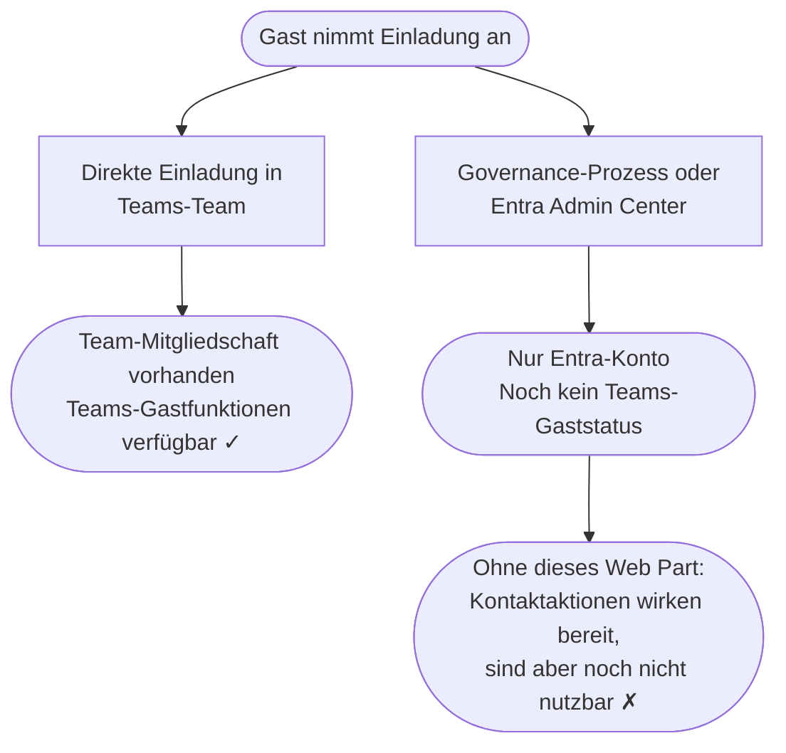

## Die verborgene Lücke {#die-luecke}

Ein Gast klickt auf „Annehmen" bei Ihrer Microsoft-365-Einladung. In Ihrem
Mandanten wird ein Microsoft-Entra-Gastbenutzerobjekt angelegt.

Was *nicht* garantiert ist: ein klarer nächster Schritt oder ein klar
sichtbarer Ansprechpartner.

Die Sponsor-Beziehung kann in Entra bereits hinterlegt sein, bleibt für den
Gast aber trotzdem unsichtbar. Es gibt in SharePoint keine eingebaute
Oberfläche, die ihm zeigt, wer seine Sponsoren sind — geschweige denn, wie er
sie erreichen kann.

Ob Teams für diesen Gast funktioniert, hängt an einem zentralen Punkt: Wurde
dieser Gast in Ihrem Tenant bereits mindestens einem Teams-Team hinzugefügt oder
nicht?

Genau daraus entsteht eine kommunikative Lücke: Die Organisation weiß
womöglich bereits, wer für diesen Gast zuständig ist. Der Gast selbst kann
davon aber nichts sehen.

## Warum Landingpages wichtig sind {#entrance-page}

In vielen Governance-getriebenen Einladungsprozessen wird aus der Weiterleitung
nach der Annahme keine bewusst gestaltete Gastreise. Wenn der Workflow den
Gast nicht an ein besseres Ziel schickt, ist My Apps ein häufiger
Einstiegspunkt —
ein Portal für App-Entdeckung und App-Start, aber nicht dafür gedacht, zu
erklären, wer für den Gast zuständig ist oder was der nächste Schritt sein
soll.

Technisch ist ein tenant-spezifischer Teams-Deeplink kein Problem. Graph-API-
basierte Einladungen können ein anderes Redirect-Ziel setzen, und Governance-
Tools können das häufig ebenfalls. Aber ein Teams-Link hilft erst dann, wenn
die Teams-Gastfunktionen für dieses Konto tatsächlich verfügbar sind. Existiert
noch keine Team-Mitgliedschaft, kann der Gast die Einladung erfolgreich
annehmen, während Teams für ihn trotzdem noch nicht bereit ist.

Genau deshalb ist eine SharePoint-Gast-Landingpage so sinnvoll. Sie ist ein
stabiler, kontrollierbarer erster Zielort, der schon funktioniert, bevor das
Teams-Onboarding abgeschlossen ist. Mit Bordmitteln kann SharePoint dort aber
vor allem statische Hinweise und allgemeine Links zeigen. Die tatsächlichen
Sponsoren des Gastes kann SharePoint nicht einblenden.

## Sponsor vs. Einladender {#sponsor-vs-inviter}

In vielen Microsoft-Entra-B2B-Onboarding-Prozessen sind Sponsor und
Einladender nicht derselbe Datensatz.

Der Einladende ist die Person oder der Prozess, der die Einladungs-Mail oder
den Workflow ausgelöst hat. Der Sponsor ist die Person oder Gruppe, die im
Sponsors-Feld von Microsoft Entra für diese Gastbeziehung eingetragen ist. In
standardmäßigen Entra-Einladungsflüssen wird der Einladende zum Standard-
Sponsor, sofern kein anderer Sponsor angegeben wird; SharePoint-
Freigabeeinladungen an neue externe Benutzer sind eine dokumentierte
Ausnahme. Gäste sehen zuerst meist den Einladenden, weil dessen Name in der
Kommunikation auftaucht. Für Rückfragen zum Zugriff und für den weiteren
Verlauf des Onboardings ist die Sponsor-Information meist relevanter.

Genau das ist für eine SharePoint-Gast-Landingpage wichtig. Wenn dort nur der
Name des Einladenden wiederholt wird, bleibt die eigentliche Sponsor-
Sichtbarkeit unsichtbar.

[Vollständige Erklärung zu Sponsor vs. Einladender]({{ '/de/sponsor-vs-inviter/' | relative_url }}).

## Zwei Wege, zwei Ergebnisse {#zwei-wege}

### Direkte Einladung in ein Teams-Team

Eine interne Person fügt einen externen Kontakt direkt einem Team hinzu, und
Microsoft sendet die Einladung im Hintergrund. Sobald der Gast annimmt und
diese erste Team-Mitgliedschaft existiert, stehen die Teams-Gastfunktionen in
Ihrem Tenant grundsätzlich zur Verfügung.

**Der Gast ist dann nicht nur in Entra, sondern hat auch einen echten Teams-Einstiegspunkt.**

### Über einen Governance-Prozess oder das Entra Admin Center

Eine Lifecycle-Governance-Plattform, ein Skript oder ein Entra-Admin-Workflow
legt das Gastkonto formal an. Das Konto existiert in Entra, aber noch kein
Teams-Team wurde zugewiesen.

**Der Gast existiert in Entra. Die Teams-Gastfunktionen fehlen aber noch.**

Dieser Zustand ist für den Gast unsichtbar, solange ihn nichts explizit
sichtbar macht.

## Was ein Gast sieht {#was-ein-gast-sieht}

Ohne Guest Sponsor Info beantwortet eine SharePoint-Landingpage meist genau
die Fragen nicht, die der Gast hat:

| Frage | Ohne dieses Web Part |
|---|---|
| Wer sind meine Sponsoren? | Für den Gast nicht sichtbar |
| Wer sind meine Ersatz-Sponsoren? | Für den Gast nicht sichtbar |
| Wie kann ich sie erreichen? | Für den Gast nicht sichtbar |
| Gibt es Manager-Kontext, der mir zur Orientierung hilft? | Für den Gast nicht sichtbar |
| Ist Teams für Kontakt schon bereit? | Für den Gast nicht sichtbar |
| Falls es eine eigene Kontaktaktion gibt | Sie kann bereit wirken, obwohl die Teams-Gastfunktionen noch nicht bereit sind |

> Es gibt keine eingebaute Erklärung, die dem Gast sagt, ob die Aktion
> unavailable ist, fehlkonfiguriert wurde oder für sein Konto schlicht noch
> nicht bereitsteht.

Mit Guest Sponsor Info wird aus dieser abstrakten Beziehung eine echte,
sichtbare Kontaktfläche für den Gast:

## Was das Web Part macht {#was-das-web-part-macht}

**Guest Sponsor Info** liegt auf der SharePoint-Landingpage, die Gäste nach
der Einladungsannahme erreichen. Es macht drei Dinge:

1. **Zeigt Sponsoren** — die internen Sponsor-Kontakte, die in Microsoft Entra
  für die Gastbeziehung eingetragen sind. Diese Beziehung ist in Entra bereits
  vorhanden, war für den Gast selbst aber bislang nicht sichtbar. Das Web Part
  macht daraus Namen, Gesichter, Titel und echte Kontaktmöglichkeiten direkt
  auf der Landingpage. Keine Konfiguration pro Gast. Keine manuelle
  Aktualisierung bei Sponsorwechsel.

2. **Zeigt Ersatz-Sponsoren und optionalen Manager-Kontext** — der Gast sieht
  nicht nur die Person, die ihn irgendwann eingeladen hat. Er sieht auch
  Ersatz-Sponsoren und ausgewählte Manager-Informationen, die die
  Kontaktstruktur verständlicher machen.

3. **Erkennt den Teams-Status** — wenn der Teams-Gastzugriff noch nicht
  bereitsteht, erkennt das Web Part das und reagiert: Chat- und Anruf-Buttons
  werden deaktiviert, und eine klare Statusmeldung erklärt die Situation. Der
  Gast sieht ein Gesicht, einen Namen und eine ehrliche Statusanzeige — keine
  Aktion, die bereit wirkt, es aber noch nicht ist.

Ein Gast, dessen Teams-Zugang noch bereitgestellt wird, kann seinen Sponsor
per E-Mail erreichen und weiß, dass Teams in Kürze folgt. Auch danach bleibt
das Web Part wertvoll: Teams blendet die Sponsor-Metadaten aus Entra nicht
einfach von selbst ein.

  

    
Bereit loszulegen?

    
Der integrierte Setup-Assistent führt Sie durch den Rest.

  

  

    <a href="{{ '/de/setup/' | relative_url }}" class="btn btn-teal">Installationsanleitung</a>
    <a href="{{ '/de/features/' | relative_url }}" class="btn btn-outline">Features entdecken</a>
  

