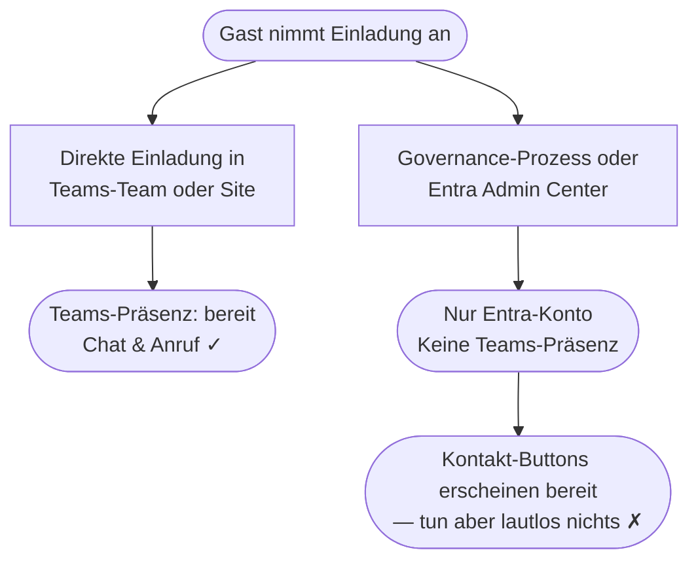

## Die Lücke, über die niemand spricht {#die-luecke}

Ein Gast klickt auf „Annehmen" bei Ihrer Microsoft-365-Einladung. Ein Entra-Konto
wird angelegt. Technisch gesehen ist diese Person jetzt in Ihrem Mandanten.

Was *nicht* garantiert ist: dass der Gast irgendjemanden erreichen kann.

Ob Teams für diesen Gast funktioniert — und ob Kontaktbuttons auf einer Landingpage
überhaupt etwas tun — hängt ausschließlich davon ab, *wie* die Person eingeladen
wurde.

---

## Zwei Einladungswege, zwei sehr verschiedene Ergebnisse {#zwei-wege}

### Direkte Einladung in ein Teams-Team oder eine SharePoint-Site

Eine interne Person fügt einen externen Kontakt einem Team oder einer Site direkt
hinzu. Microsoft sendet die Einladung im Hintergrund. Sobald der Gast annimmt,
tritt er dem Team bei — Teams beginnt sofort, seine Präsenz aufzubauen.

**Der Gast ist innerhalb weniger Minuten in Teams einsatzbereit.**

### Über einen Governance-Prozess oder das Entra Admin Center

Eine Lifecycle-Governance-Plattform, ein Skript oder ein Entra-Admin-Workflow legt
das Gastkonto formal an. Das Konto existiert in Entra — aber noch kein Teams-Team
wurde zugewiesen.

**Der Gast existiert in Entra. Er existiert noch nicht in Teams.**

Dieser Zustand ist für den Gast unsichtbar — und bleibt ohne explizites Feedback
völlig verborgen.

---

## Was ein Gast sieht {#was-ein-gast-sieht}

Auf einer SharePoint-Landingpage könnte eine Sponsor-Visitenkarte folgendes zeigen:

| Feld | Status |
|---|---|
| Name und Profilfoto des Sponsors | ✓ Verfügbar über Entra |
| E-Mail-Adresse | ✓ Verfügbar |
| Teams-Chat-Button | Dargestellt — tut aber lautlos nichts |
| Teams-Anruf-Button | Dargestellt — tut aber lautlos nichts |

> Es gibt keinen Fehler. Keine Erklärung. Der Gast hat keine Möglichkeit zu
> erkennen, ob der Button defekt ist, ob er etwas falsch gemacht hat, oder ob
> die Funktion für ihn schlicht noch nicht bereit ist.

---

## Was dieses Web Part macht {#was-das-web-part-macht}

**Guest Sponsor Info** liegt auf der SharePoint-Landingpage, auf der Gäste nach
der Einladungsannahme landen. Es macht zwei Dinge:

1. **Zeigt Sponsoren** — die internen Mitarbeiter, die in Microsoft Entra als
   Verantwortliche für den Gastzugang eingetragen sind. Name, Foto, Titel und
   Kontaktmöglichkeiten. Keine Konfiguration pro Gast. Keine manuelle
   Aktualisierung bei Sponsorwechsel.

2. **Erkennt den Teams-Status** — wenn die Teams-Präsenz noch nicht aufgebaut
   wurde, erkennt das Web Part das und reagiert: Chat- und Anruf-Buttons werden
   deaktiviert, und eine klare Statusmeldung erklärt die Situation. Der Gast
   sieht ein Gesicht, einen Namen und eine ehrliche Statusanzeige — keinen
   defekten Button.

Ein Gast, dessen Teams-Zugang noch bereitgestellt wird, kann seinen Sponsor per
E-Mail erreichen und weiß, dass Teams in Kürze folgt. Keine Verwirrung. Kein
lautloses Scheitern.

---

Bereit loszulegen? Zur [Installationsanleitung]({{ '/de/setup/' | relative_url }}).
