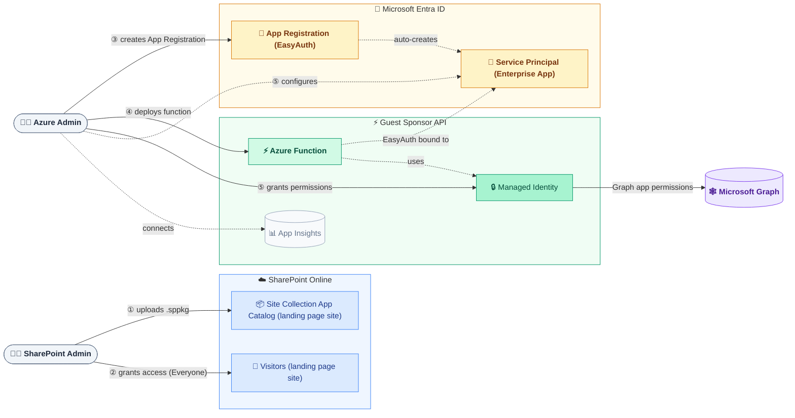
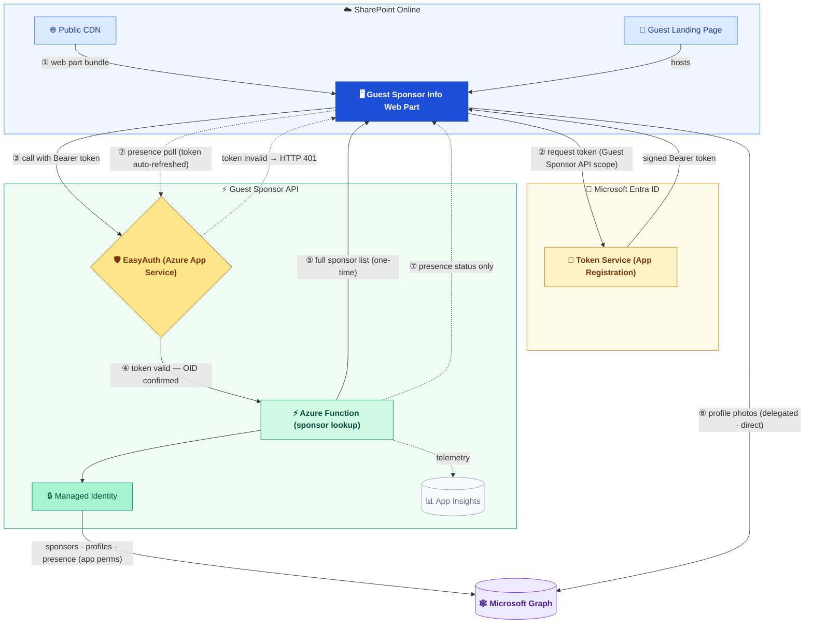

## Setup — Two Admin Roles

Two separate admin personas are involved in setting up the solution.
The **SharePoint Admin** only needs the standard SharePoint Administrator role.
The **Azure Admin** covers three distinct responsibilities — Azure resource
deployment, Entra ID app configuration, and Graph permission grants — each
requiring different elevated permissions.

### Required permissions

| Step | Who | What happens | Required role |
|---|---|---|---|
| ① | SharePoint Admin | Enables Site Collection App Catalog and uploads `.sppkg` | **SharePoint Administrator** + Site Collection Admin |
| ② | SharePoint Admin | Verifies or sets up guest Visitor access | **SharePoint Administrator** |
| ③ | Azure Admin | Creates the App Registration (`setup-app-registration.ps1`) | **Application Administrator** |
| ④ | Azure Admin | Deploys ARM template — Azure resources + Storage role assignments | **Owner** on target resource group |
| ⑤ | Azure Admin | Grants Graph permissions to Managed Identity (`setup-graph-permissions.ps1`) | **Privileged Role Administrator** |

---

## Runtime — Guest Experience

Color-coding marks system boundaries at a glance:
**blue** = SharePoint Online · **amber** = Microsoft Entra ID ·
**green** = Guest Sponsor API · **purple** = Microsoft Graph.

### What each step means

| Step | What happens |
|---|---|
| ① | The guest opens the SharePoint landing page. The browser loads the web part bundle from the Public CDN. |
| ② | The web part silently requests a token from Entra ID, scoped to the Guest Sponsor API. No extra guest consent required. |
| ③ | The web part calls the Guest Sponsor API with the Bearer token attached. |
| ④ | [EasyAuth](https://learn.microsoft.com/azure/app-service/overview-authentication-authorization) validates the token before any function code runs. Invalid tokens are rejected immediately (HTTP 401). |
| ⑤ | The function identifies the guest from the EasyAuth-confirmed OID and calls Microsoft Graph using its Managed Identity. Returns the full sponsor list in one response. |
| ⑥ | Profile photos are loaded **directly** from Graph using the guest's own delegated token — they bypass the function entirely. |
| ⑦ | After the initial load, presence is polled at adaptive intervals: **30 s** (card hovered) · **2 min** (tab visible) · **5 min** (tab hidden). |

---

## Component Summary

| Component | Role |
|---|---|
| SharePoint App Catalog | Stores the packaged solution; publishes assets to the CDN |
| Public CDN | Delivers the web part JavaScript bundle to the guest's browser |
| Web Part | Guest-facing UI rendered inside the SharePoint page |
| Token Service (Entra ID) | Issues tokens that identify the guest |
| Guest Sponsor API | Secure proxy; validates caller identity via EasyAuth, calls Graph using Managed Identity |
| EasyAuth | Azure App Service Authentication — validates tokens at the function boundary |
| Managed Identity | Allows the function to call Graph without stored credentials |
| Microsoft Graph | Source of sponsor relationships, profiles, photos, and presence |
| Application Insights | Telemetry and structured error logs for the function |
