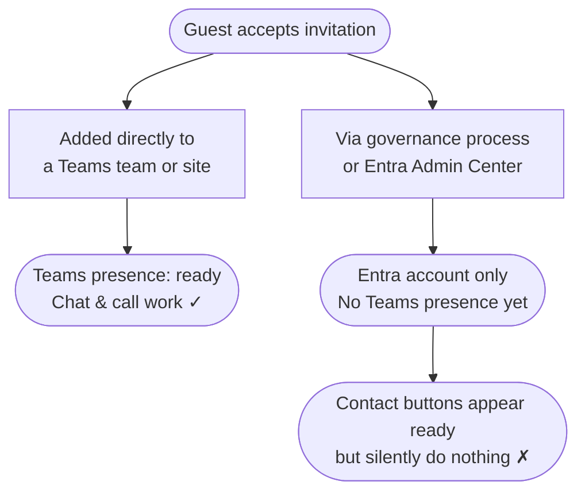

## The Gap Nobody Talks About {#the-gap}

A guest clicks "Accept" on your Microsoft 365 invitation. An Entra account is
created. Technically, they are now inside your tenant.

What is *not* guaranteed: that they can actually reach anyone.

Whether Teams works for this guest — and whether contact buttons on a landing page
do anything at all — depends entirely on *how* they were invited.

---

## Two Invitation Paths, Two Very Different Outcomes {#two-paths}

### Directly added to a Teams team or SharePoint site

An employee adds an external contact to a team or site directly. Microsoft sends
the invitation behind the scenes. The moment the guest accepts, they join that
team — and Teams begins establishing their presence immediately.

**The guest is ready in Teams within minutes.**

### Via a governance process or the Entra Admin Center

A lifecycle governance platform, a script, or an Entra admin workflow creates the
guest account formally. The account exists in Entra — but no Teams team has been
assigned yet.

**The guest exists in Entra. They do not yet exist in Teams.**

This state is invisible to the guest — and entirely invisible without something
that explicitly surfaces it.

---

## What the Guest Sees {#what-the-guest-sees}

On a SharePoint landing page, a sponsor contact card might show:

| Field | Status |
|---|---|
| Sponsor name and profile photo | ✓ Available via Entra |
| Email address | ✓ Available |
| Teams chat button | Rendered — but silently does nothing |
| Teams call button | Rendered — but silently does nothing |

> There is no error. There is no explanation. The guest has no way to know
> whether the button is broken, whether they did something wrong, or whether
> this feature simply isn't ready for them yet.

---

## What This Web Part Does {#what-this-web-part-does}

**Guest Sponsor Info** is placed on the SharePoint landing page guests arrive at
after accepting an invitation. It does two things:

1. **Shows sponsors** — the internal employees assigned in Microsoft Entra as
   responsible for the guest's access. Names, photos, titles, and contact options.
   No per-guest configuration. No manual updates when sponsors change.

2. **Detects Teams readiness** — if Teams presence has not been established yet,
   the web part detects this and responds: chat and call buttons are disabled, and
   a clear status message explains the situation. The guest sees a face, a name,
   and an honest status — not a broken button.

A guest whose Teams access is still being provisioned can reach their sponsor by
email and knows that Teams is on its way. No confusion. No silent failure.

---

Ready to set it up? See the [Setup Guide]({{ '/en/setup/' | relative_url }}).
