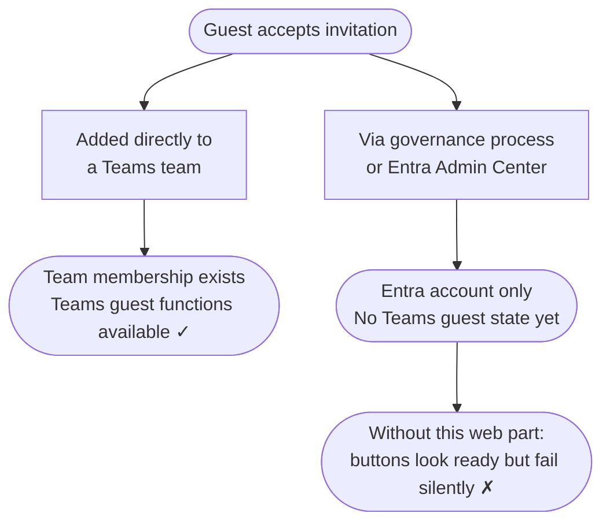

## The Gap Nobody Talks About {#the-gap}

A guest clicks "Accept" on your Microsoft 365 invitation. An Entra account is
created. Technically, they are now inside your tenant.

What is *not* guaranteed: that they can actually reach anyone.

The sponsor relationship may already exist in Entra. But for the guest, that
relationship is still invisible. There is no built-in SharePoint experience
that shows them who their sponsors are, let alone how to contact them.

Whether Teams works for this guest depends on one central fact: has this guest
already been added to at least one Teams team in your tenant, or not?

And that creates a communication gap: the organisation may already know who is
responsible for the guest, but the guest cannot see any of it.

## Why an Entrance Page Matters {#entrance-page}

In many governance-driven invitation flows, the redirect after invitation
redemption is never turned into a deliberate guest journey. If the workflow
doesn't point the guest somewhere better, they often end up in MyApps — a
generic destination that does not explain where they are, who is responsible
for them, or what to do next.

Technically, a tenant-scoped Teams deep link is not hard to generate. Graph API
invitation flows can set a custom redirect URL, and governance tools often can
too. But a Teams link only helps once the guest can actually enter your tenant
in Teams. If no team membership exists yet, the guest may accept the invitation
successfully and still not be able to switch into the resource tenant in Teams
— sometimes not even see it there.

That is why a SharePoint entrance page is such a pragmatic answer. It is a
stable, controllable first destination that can work before Teams onboarding is
finished. The weakness is that SharePoint out of the box can show only static
guidance and generic links. It cannot surface the guest's actual sponsors.

## Two Invitation Paths, Two Very Different Outcomes {#two-paths}

### Directly added to a Teams team

An employee adds an external contact directly to a team. Microsoft sends the
invitation behind the scenes. Once the guest accepts and that first team
membership is in place, Teams guest functionality becomes available in your
tenant.

**The guest is not just in Entra. They also have a real Teams entry point.**

### Via a governance process or the Entra Admin Center

A lifecycle governance platform, a script, or an Entra admin workflow creates the
guest account formally. The account exists in Entra — but no Teams team has been
assigned yet.

**The guest exists in Entra. Teams guest functionality is not there yet.**

This state is invisible to the guest — and entirely invisible without something
that explicitly surfaces it.

## What the Guest Sees {#what-the-guest-sees}

Without Guest Sponsor Info on the page, a SharePoint landing page usually
doesn't answer the questions the guest actually has:

| Question | Without this web part |
|---|---|
| Who are my sponsors? | Not visible to the guest |
| Who are my backup sponsors? | Not visible to the guest |
| How do I reach them? | Not visible to the guest |
| Is there manager context that helps me orient myself? | Not visible to the guest |
| Is Teams already ready for contact? | Not visible to the guest |
| If a custom contact action exists | It may look ready and still fail silently |

> There is no error. There is no explanation. The guest has no way to know
> whether the button is broken, whether they did something wrong, or whether
> this feature simply isn't ready for them yet.

With Guest Sponsor Info on the page, that abstract relationship becomes a real,
visible contact surface for the guest:

## What This Web Part Does {#what-this-web-part-does}

**Guest Sponsor Info** is placed on the SharePoint landing page guests arrive at
after accepting an invitation. It does three things:

1. **Shows sponsors** — the internal employees assigned in Microsoft Entra as
  responsible for the guest's access. That relationship already exists in Entra,
  but the guest could not previously see it for themselves. The web part turns
  it into names, faces, titles, and actual contact options on the landing page.
  No per-guest configuration. No manual updates when sponsors change.

2. **Shows backup sponsors and optional manager context** — the guest does not
   just see the one person who happened to invite them. They can also see
   replacement sponsors and selected manager information that makes the contact
   structure easier to understand.

3. **Detects Teams readiness** — if Teams presence has not been established yet,
   the web part detects this and responds: chat and call buttons are disabled, and
   a clear status message explains the situation. The guest sees a face, a name,
   and an honest status — not a broken button.

A guest whose Teams access is still being provisioned can reach their sponsor by
email and knows that Teams is on its way. And even after Teams is working, the
web part still adds value: Teams itself does not tell the guest who their
sponsors are. The guest would have to know those names already and search for
them manually.

  

    
Ready to set it up?

    
The built-in Setup Wizard guides you through the rest.

  

  

    <a href="{{ '/en/setup/' | relative_url }}" class="btn btn-teal">Setup Guide</a>
    <a href="{{ '/en/features/' | relative_url }}" class="btn btn-outline">Explore Features</a>
  

